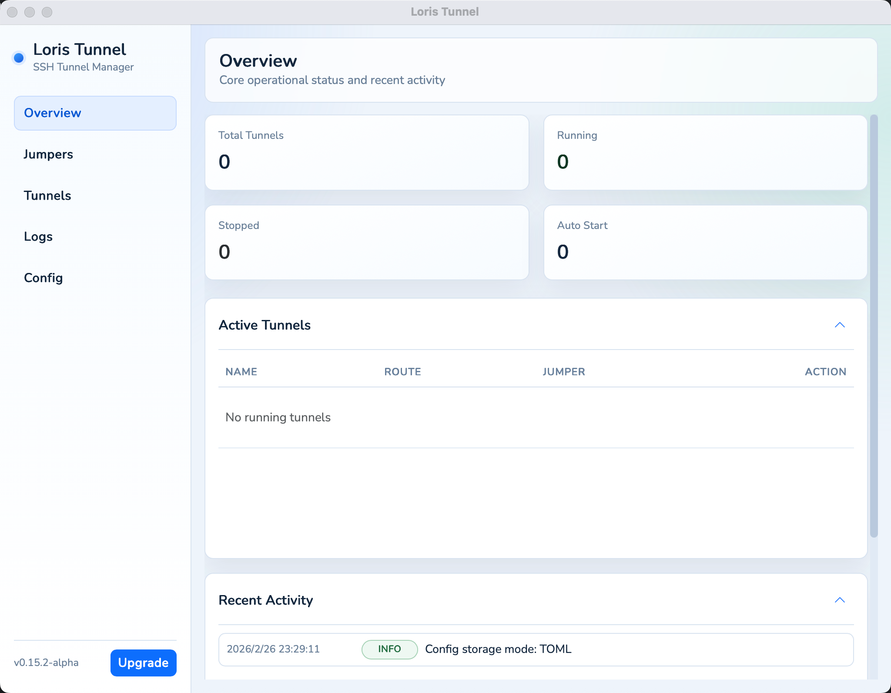

# Loris Tunnel

<div align="center">

[简体中文](README.CN.md)

**A desktop GUI application for managing SSH tunnels — with automatic reconnection and a clean interface.**


</div>

---

## Overview

**Loris Tunnel** is a cross-platform desktop app that lets you create, manage, and monitor SSH tunnels through a graphical interface. It wraps the power of SSH port forwarding into a user-friendly UI, with automatic reconnection to keep your tunnels alive even when the network is unstable.

Designed for developers and ops engineers who frequently work with remote servers, databases, and internal services behind firewalls — without touching the command line every time.



---

## Features

- 🖥️ **Graphical tunnel management** — create, edit, start, stop, and monitor all your SSH tunnels from a clean desktop UI; no command line needed day-to-day
- 🔄 **Smart Automatic Reconnection** — intelligent exponential backoff ensures tunnels recover seamlessly from network drops or SSH interruptions, with real-time status visibility in the UI
- ⚡ **Real-time latency monitoring with fastest-route selection** — continuously measure and display SSH latency across lines, sort by response time, and switch to the fastest route in one click
- 📥 **Import tunnels from SSH command** — paste any `ssh` command and all `-L`/`-R`/`-D` port-forwarding flags are parsed at once, creating multiple tunnels in a single step
- 📋 **Duplicate tunnel for fast setup** — clone an existing tunnel with one click to quickly create variants without re-entering all the fields
- ⛓️ **Multi-hop jumper chains** — configure multiple SSH jumper servers per tunnel for deeply nested networks (e.g. bastion → internal host)
- 🔀 **Local, remote and dynamic (SOCKS5) port forwarding** — all standard SSH tunnel modes supported
- ✅ **Built-in connection test** — verify a tunnel is reachable before saving, directly from the create/edit dialog
- ▶️ **Auto-start tunnels on launch** — mark tunnels to open automatically when the app starts
- 🌍 **Cross-platform** — macOS and Windows supported
- 💬 **Multi-language UI** — English and 简体中文

---

## Screenshots

**Import tunnels from an SSH command:**


**Real-time SSH connection latency:**


---

## Getting Started

### Download

Download the latest release from the [Releases](../../releases) page.

- **macOS**: `.dmg` installer
- **Windows**: `.exe` installer

### macOS Security Bypass

When running the macOS version for the first time, you may encounter a system security block. Here are two methods to bypass it:

**Method 1: System Settings**

1. When you see the security block popup, click "Cancel"
2. Open "System Settings" -> "Privacy & Security"
3. Scroll down to the Security section and click "Open Anyway"

**Method 2: Terminal Command**

Open Terminal and run the following command (you may need to enter your computer password):

```bash
sudo xattr -rd com.apple.quarantine /Applications/loris-tunnel.app
```

### Build from Source

**Prerequisites:**

- [Go](https://golang.org/dl/) ≥ 1.21
- [Node.js](https://nodejs.org/) ≥ 18 + [pnpm](https://pnpm.io/)
- [Wails CLI](https://wails.io/docs/gettingstarted/installation) v2

```bash
git clone https://github.com/YOUR_USERNAME/loris-tunnel.git
cd loris-tunnel

# Install frontend dependencies
cd frontend && pnpm install && cd ..

# Run in development mode
wails dev

# Build production binary
wails build
```

---

## Configuration

Loris Tunnel stores its configuration in a TOML file. Default resolution order:

- If the current working directory is writable: `./config.toml`
- Otherwise: `~/.loris-tunnel/config.toml`
- Override with env var: `LORIS_TUNNEL_CONFIG_PATH`

Example configuration:

```toml
[[jumpers]]
name = "my-server"
host = "example.com"
port = 22
user = "ubuntu"
auth_method = "agent"      # or "key"
# identity = "~/.ssh/id_rsa"

[[tunnels]]
name = "local-db"
jumper = "my-server"
mode = "local"             # local | remote | socks5
local_port = 5432
remote_host = "127.0.0.1"
remote_port = 5432
```

---

## SSH Tunnel Modes

| Mode | Description |
|------|-------------|
| `local` | Forward a local port to a remote address via the SSH server |
| `remote` | Forward a remote port on the SSH server to a local address |
| `socks5` | Use the SSH server as a SOCKS5 proxy (dynamic forwarding) |

---

## Tech Stack

| Layer | Technology |
|-------|-----------|
| Desktop framework | [Wails](https://wails.io/) v2 |
| Backend | Go |
| Frontend | Vue 3 + Vite |
| SSH | Go `golang.org/x/crypto/ssh` |

---

## License

Apache License 2.0.
