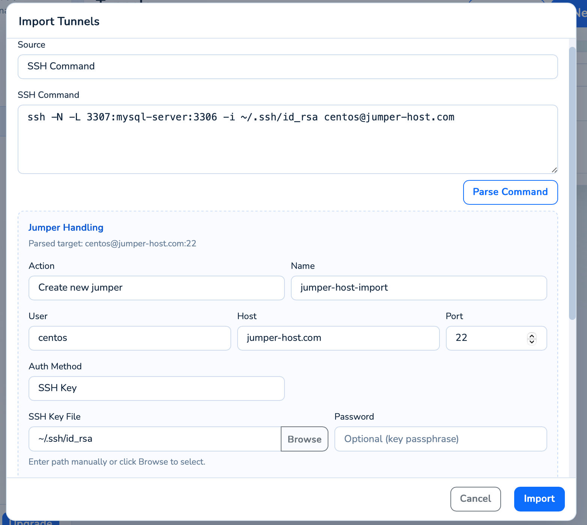

# Introduction to Loris Tunnel

**Loris Tunnel** wraps the power of SSH port forwarding into a user-friendly UI, with automatic reconnection to keep your tunnels alive.

## Features

- ⚡ **Real-time latency monitoring** — measure and display SSH latency across lines.
- 📥 **Import from SSH command** — parse `-L`/`-R`/`-D` flags automatically.
- 🔀 **Multiple Modes** — Local, remote, and dynamic (SOCKS5) port forwarding supported.
- ▶️ **Auto-start** — Mark tunnels to open automatically when the app starts.

## Why Loris Tunnel?

Designed for developers and ops engineers who frequently work with remote servers, databases, and internal services behind firewalls — without touching the command line every time.

::: tip Getting Started
Download the latest release for macOS or Windows. Loris Tunnel is built with Wails for a native feel.
:::

## Community

Join our QQ group (**1009737419**) for discussions and support!
