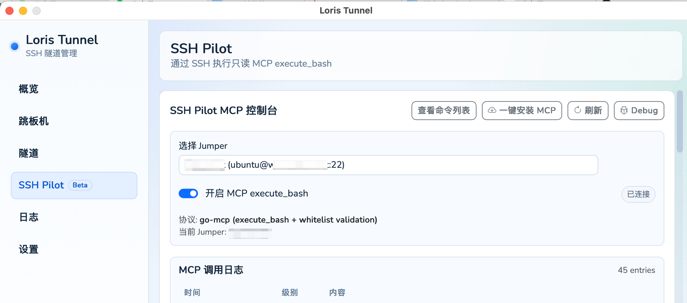
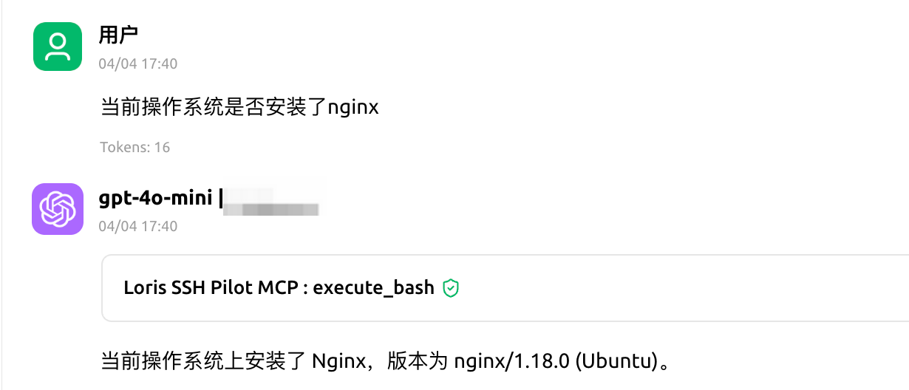

# Cherry Studio, Codex & SSH MCP: Control AI Access to Production Servers with Loris Tunnel SSH Pilot

Developers and operators often want an **AI assistant to reason about live servers**—for example, whether **Nginx** is installed, which ports listen, or quick read-only diagnostics—**without** handing the model a full interactive shell or opening extra public endpoints.

The **SSH Pilot (Beta)** work on the **loris-69** branch productizes that pattern: inside the **Loris Tunnel** desktop app you pick a **jumper** (bastion / jump host), enable **MCP `execute_bash`**, and carry traffic over **SSH** while exposing a **Model Context Protocol (MCP)** tool surface. That fits **Cherry Studio**, **Codex**, and any other **MCP-capable client** that can point at a local MCP server.

Below, two screenshots show the **SSH Pilot MCP console** in Loris Tunnel and a **Cherry Studio** chat where the model calls **`Loris SSH Pilot MCP : execute_bash`**—useful for English-market SEO around **Cherry Studio MCP**, **Codex SSH**, **SSH MCP**, and **AI server operations**.

## Why "SSH + MCP" instead of raw SSH to the model

- **Single integration surface**: the AI client talks **MCP**, not your ad-hoc terminal session.
- **Auditability**: calls land in **MCP call logs** inside the app so you can answer "what did the model actually run?"
- **Policy, not vibes**: **read-only** semantics plus **whitelist validation** shrink the bash surface from "anything" to an ops-approved command set.

If you already use **Codex** over **SSH** for remote dev and **Cherry Studio** for multi-model chat, point MCP at the endpoint **Loris Tunnel** exposes for SSH Pilot and you can trigger **controlled remote inspection** from natural language—exactly the workflow people search for as **Cherry Studio SSH**, **MCP SSH tunnel**, or **execute_bash MCP**.

## SSH Pilot console: jumper, MCP toggle, connection status

In **Loris Tunnel → SSH Pilot (Beta)** you can:

- **Select a jumper** aligned with your existing bastion / tunnel profiles so host metadata stays in one place.
- **One-click MCP setup** (when available in your build) to reduce friction on the remote side.
- **Enable MCP `execute_bash`** to bring up the bridge; the UI shows protocol details (for example **go-mcp** with **whitelist validation**) and a **Connected** state.
- Use **view command list**, **Debug**, and **Refresh** to verify allowed commands and troubleshoot.

This screen is the **control plane**: **SSH** carries the session; **MCP** is the **tool layer** the model sees—a practical split for **AI + production servers** when you care about guardrails.

## Cherry Studio demo: ask in natural language, tool calls go through Loris SSH Pilot MCP

After you add an MCP server in **Cherry Studio** that targets SSH Pilot, the transcript shows tool rows such as **`Loris SSH Pilot MCP : execute_bash`**. The model proposes read-only diagnostics; allowed commands pass **whitelist** checks on the remote side, then the assistant summarizes facts back to the user.

Example prompt (works in English or your UI language): *"Is Nginx installed on this server?"*—the model uses **`execute_bash`** (for example `nginx -v` or package-manager queries) and returns version and OS context.

This screenshot is strong **landing-page proof** for **Cherry Studio + SSH**: visible **tool name**, **success state**, and a **clear natural-language answer**.

## How this relates to Codex and other MCP clients

- **OpenAI Codex**: if your workflow is already **SSH + remote agent + local browser callbacks**, keep using **Loris Tunnel** for [stable port forwards](./20260331-codex-ssh-login-with-loris-tunnel). When you need the model to **read ground truth from a host**, add **MCP via SSH Pilot** alongside that stack.
- **Any MCP-capable IDE or chat app**: if it supports custom MCP servers, it can consume the same SSH Pilot capability; **Cherry Studio** is one of the clearest graphical demos.

## Security and compliance checklist (before production)

- Treat the feature as a **read-only ops copilot**: assume every allowed command was reviewed against policy.
- Use a **dedicated low-privilege SSH user**; avoid blanket **sudo**; pair with bastion auditing where required.
- **Stage on non-prod** first: validate command coverage and logs against internal controls before attaching production read-only accounts.
- **Watch MCP call logs** for unusual frequency or command patterns; wire alerts or circuit-breakers if needed.

## Summary and further reading

**loris-69 / SSH Pilot** addresses **Cherry Studio (or Codex) + MCP + SSH** in a controlled way: structured tools and logs instead of "paste this SSH password into chat."

**Get Loris Tunnel**: [GitHub — loris-tunnel-app Releases](https://github.com/RangerWolf/loris-tunnel-app/releases)  
**More on SSH tunnels**: [Introduction to Loris Tunnel](./20260316-introduction) · [Codex SSH login and port forwarding](./20260331-codex-ssh-login-with-loris-tunnel)

::: info Trademarks and beta scope
SSH Pilot is a **beta** capability; menu labels, buttons, and protocol details may vary by release. **Cherry Studio**, **Codex**, **OpenAI**, and other names are trademarks of their respective owners. **Loris Tunnel** is an independent application and is not affiliated with or endorsed by those vendors.
:::
